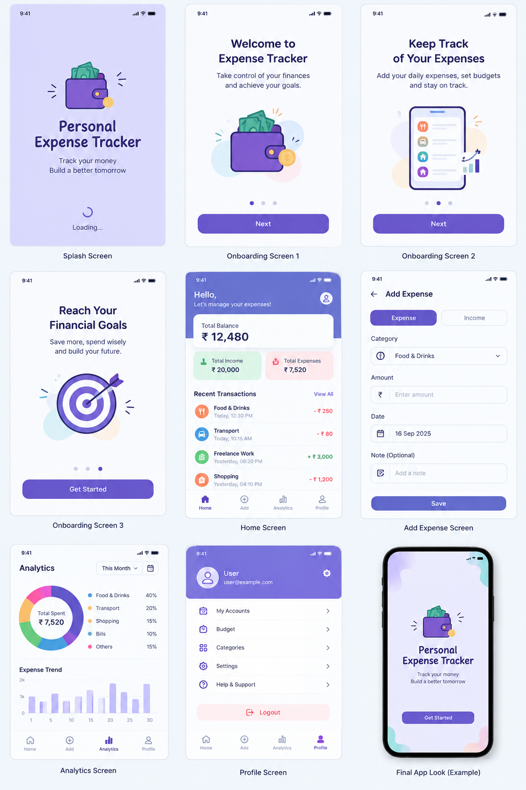
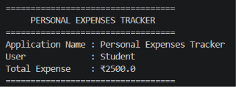
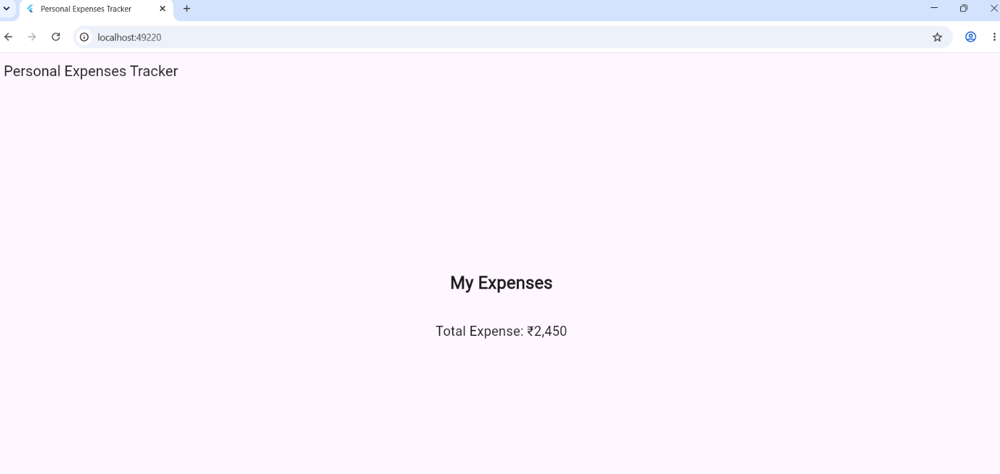
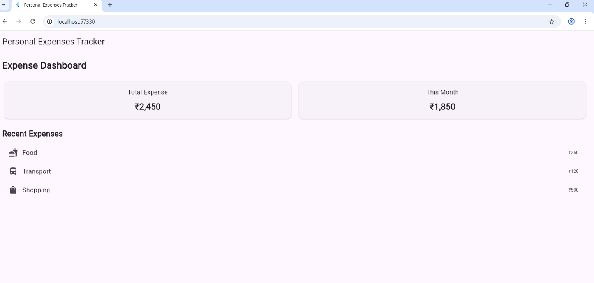

# Personal Expenses Tracker

## Abstract

The Personal Expenses Tracker is a Flutter-based mobile application developed to help users keep track of their daily expenses in a simple and organized way. The application will provide features such as adding expenses, viewing expense details, managing expense categories, and checking total spending.

The project is developed step by step by implementing different Flutter and Dart concepts through experiments. The application will gradually be improved by adding widgets, layouts, responsive design, user input, expense lists, and other useful features.

## Expected App

The final application is expected to provide a simple and user-friendly interface for managing personal expenses. Users will be able to view their total spending, add new expenses, view expense details and organize expenses based on categories.

### Expected Final Output

The final output is expected to contain a dashboard showing the total expenses, a list of recent expenses with their categories and amounts, and an option to add a new expense.

## Experiment 1(A) – Introduction to Flutter

In this experiment, I created the basic Personal Expenses Tracker project and worked with some basic Dart concepts. A simple program was created using variables and print statements to display basic expense-related information in the terminal.

The program displays the application name, expense category, and expense amount. This experiment helped in understanding the basic structure of a Dart program before moving on to Flutter widgets and user interface development.

## Experiment 1(A) Output

The following screenshot shows the terminal output of the basic Personal Expenses Tracker program.

## Experiment 1(B) – Basic Flutter Application

In this experiment, a basic Flutter application is created using widgets such as `MaterialApp`, `Scaffold`, `AppBar`, `Column`, `Text`, and `Container`. A simple Personal Expenses Tracker screen is designed to display the application title, expense heading and total expense. This experiment helps in understanding the basic structure of a Flutter user interface and how different widgets are arranged together.

## Experiment 1(B) Output

The following screenshot shows the basic Personal Expenses Tracker interface created using Flutter widgets.

## Experiment 2(A) – Flutter Widgets and Layouts

In this experiment, the Personal Expenses Tracker interface is improved using different Flutter widgets and layouts. Widgets such as `Card`, `Row`, `Column`, `Expanded`, `Padding`, and `ListTile` are used to arrange the expense information. The screen displays the total expense, monthly expense and a list of recent expenses. This experiment helps in understanding how Flutter widgets can be combined to create a simple and organized user interface.

## Experiment 2(A) Output

The following screenshot shows the Expense Dashboard created using Flutter widgets and layouts.

